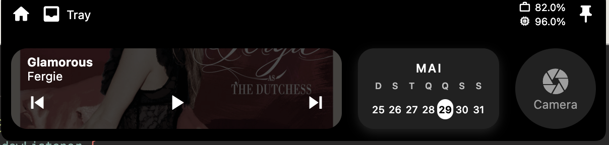

# 🏝️ Island - Dynamic Island para MacBook

Uma implementação elegante e funcional do Dynamic Island do iPhone para MacBook, desenvolvida em Flutter com foco em produtividade e experiência do usuário.

## 📸 Demonstração

### Estado Compacto


### Estado Expandido



## ⭐ O que é o Island?

O **Island** é uma aplicação que traz a experiência do Dynamic Island do iPhone para o MacBook, oferecendo uma interface compacta e intuitiva que se adapta dinamicamente às suas necessidades. Ele permanece sempre visível na tela, proporcionando acesso rápido a informações e funcionalidades essenciais do sistema.

## 🚀 Funcionalidades

### 1. 📊 Monitor de Sistema Integrado

- **Memória RAM**: Monitoramento em tempo real com exibição de:
  - Porcentagem de uso atual
  - Memória total do sistema (GB)
  - Memória em uso (GB)
- **CPU**: Monitoramento do processamento em tempo real
- **Armazenamento**: Porcentagem de espaço em disco utilizado
- **Interface visual**: Gráficos compactos e percentuais intuitivos
- **Atualização automática**: Dados atualizados a cada 2 segundos

### 2. 📋 Bandeja de Arquivos (Clipboard Avançado)

Sistema de gerenciamento de arquivos com clipboard inteligente:

- **Drag & Drop**: Arraste arquivos do Finder para armazenar temporariamente
- **Clipboard moderno**: Integração com `super_clipboard` para melhor compatibilidade
- **Cópia inteligente**:
  - Toque simples → copia o arquivo para o clipboard do sistema
  - Suporte para múltiplos arquivos
- **Gestão avançada**:
  - Remova itens individualmente
  - Limpe todos os arquivos de uma vez
  - Arquivos em memória e referências de sistema
- **Feedback visual**: Animações e confirmações visuais
- **Arquivos temporários**: Limpeza automática de arquivos temp

### 3. 📷 Espelho (Mini Câmera)

- **Câmera integrada**: Visualização da câmera do MacBook usando `camera_macos`
- **Controle completo**: Liga/desliga com um toque
- **Interface compacta**: Design circular como um pequeno espelho digital
- **Permissões nativas**: Solicitação automática de permissões de câmera
- **Gestão de recursos**: Liberação automática da câmera quando não utilizada

### 4. 📅 Calendário e Data

- **Data atual**: Exibição da data de hoje
- **Interface limpa**: Design minimalista e informativo
- **Atualização automática**: Sempre sincronizado com o sistema
- **Formato brasileiro**: Data no formato DD/MM/AAAA

### 5. 🎵 Player de Música (Spotify)

- **Controles completos**:
  - ⏮️ Voltar para música anterior
  - ⏯️ Play/Pause
  - ⏭️ Avançar para próxima música
- **Integração nativa**: Funciona diretamente com o Spotify via AppleScript
- **Interface familiar**: Controles intuitivos e responsivos
- **Estado em tempo real**: Sincronização com o player ativo

### 6. 🏠 Hub Central (Home)

- **Navegação centralizada**: Acesso rápido a todas as funcionalidades
- **Interface adaptativa**: Se ajusta ao estado hover/pinned
- **Controle de estado**: Botão de pin para manter expandido

## 🏗️ Arquitetura

O projeto foi desenvolvido seguindo os **princípios SOLID** e práticas de **Código Limpo**, garantindo alta qualidade e manutenibilidade.

### Princípios SOLID Aplicados

#### Single Responsibility Principle (SRP)

```dart
// Cada serviço tem uma responsabilidade única
abstract class IFileManagerService {
  // Gerencia apenas arquivos em memória
}

abstract class IClipboardService {
  // Gerencia apenas operações de clipboard
}
```

#### Open/Closed Principle (OCP)

```dart
// Módulos extensíveis através de interfaces
abstract class IClipboardService {
  Future<bool> copyFileToClipboard(DroppedFile file);
  // Novas implementações podem ser adicionadas sem modificar código existente
}
```

#### Liskov Substitution Principle (LSP)

```dart
// Implementações são substituíveis
class ModernClipboardService implements IClipboardService { }
class MacOSClipboardService implements IClipboardService { }
```

#### Interface Segregation Principle (ISP)

```dart
// Interfaces específicas e bem definidas
abstract class IFileManagerService {
  // Apenas métodos relacionados ao gerenciamento de arquivos
}
```

#### Dependency Inversion Principle (DIP)

```dart
// Dependência de abstrações, não implementações
class FileManagerService {
  final IClipboardService _clipboardService = ClipboardServiceFactory.create();
}
```

### Estrutura de Módulos

```
lib/modules/
├── dynamic/          # Comportamento dinâmico do Island (hover, pin, animações)
├── static_monitor/   # Monitor de sistema (CPU/RAM) via MethodChannel
├── copy/             # Bandeja de arquivos e clipboard avançado
│   ├── models/       # Modelos de dados (DroppedFile)
│   ├── services/     # Serviços (FileManager, Clipboard)
│   └── widgets/      # Componentes UI (FileGrid, DashedBorder)
├── camera/           # Funcionalidade de espelho/câmera nativa
├── playing/          # Player de música (Spotify) via AppleScript
├── disk_space/       # Monitor de espaço em disco
├── calendar/         # Widget de calendário e data
├── cmd/              # Comandos e utilitários do sistema
└── home/             # Tela principal e navegação
```

### Arquitetura Nativa (macOS)

```swift
// SystemMonitor.swift - Monitoramento de sistema
class SystemMonitor {
  static func getCpuUsage() -> Double { }
  static func getMemoryInfo() -> [String: Double] { }
}

// AppDelegate.swift - Bridge Flutter ↔ Swift
@main
class AppDelegate: FlutterAppDelegate {
  // MethodChannel para comunicação nativa
}
```

## 🛠️ Tecnologias Utilizadas

### Frontend (Flutter)

- **Flutter** `^3.6.0` - Framework principal
- **Dart SDK** `^3.6.0` - Linguagem de programação

### Gerenciamento de Janela

- **window_manager** `^0.4.3` - Controle avançado de janela
- **desktop_drop** `^0.4.4` - Funcionalidade drag & drop nativa

### Funcionalidades Específicas

- **super_clipboard** `^0.8.24` - Operações avançadas de clipboard
- **camera_macos** `^0.0.9` - Acesso à câmera no macOS
- **cross_file** `^0.3.4+2` - Manipulação de arquivos cross-platform
- **http** `^1.2.0` - Requisições de rede para APIs
- **path** `^1.9.0` - Manipulação de caminhos de arquivo

### Desenvolvimento

- **json_annotation** `^4.9.0` - Serialização JSON
- **json_serializable** `^6.7.1` - Geração de código para JSON
- **build_runner** `^2.4.7` - Sistema de build para geração de código

### Assets e Ícones

- **flutter_launcher_icons** `^0.14.3` - Geração de ícones da aplicação

## 📋 Pré-requisitos

### Sistema

- **macOS** 10.15+ (Catalina ou superior)
- **Xcode** 13.0+ (para compilação nativa)

### Desenvolvimento

- **Flutter** 3.6.0 ou superior
- **Dart SDK** 3.6.0 ou superior

### Aplicações Externas

- **Spotify** instalado (para funcionalidade de música)

### Permissões macOS

O Island solicita automaticamente as seguintes permissões:

- **Câmera**: Para funcionalidade de espelho
- **Eventos Apple**: Para integração com Spotify
- **Informações do Sistema**: Para monitoramento de recursos

## 🚀 Instalação e Execução

### 1. Clone o repositório

```bash
git clone https://github.com/seu-usuario/island.git
cd island
```

### 2. Instale as dependências

```bash
flutter pub get
```

### 3. Execute o aplicativo

```bash
flutter run -d macos
```

### 4. Configurações de Permissões

Na primeira execução, o macOS solicitará permissões para:

- Acesso à câmera
- Controle de outras aplicações (Spotify)
- Monitoramento do sistema

## 🎯 Como Usar

### Inicialização

1. Execute o aplicativo
2. O Island aparecerá como uma pequena barra na parte superior da tela
3. **Hover**: Mova o mouse para o topo da tela para expandir
4. **Pin**: Clique no ícone de pin para manter expandido

### Navegação entre Módulos

- **Estado compacto**: Mostra CPU, memória e espaço em disco
- **Estado expandido**: Acesso completo a todas as funcionalidades
- **Drag & Drop**: Funciona automaticamente quando expandido

### Funcionalidades Específicas

#### 📊 Monitor de Sistema

- Visualização automática em ambos os estados
- **Compacto**: Indicadores básicos
- **Expandido**: Informações detalhadas

#### 📋 Bandeja de Arquivos

1. Arraste arquivos do Finder para a área de drop
2. Clique em um arquivo para copiá-lo ao clipboard
3. Use os controles para gerenciar a lista
4. Arquivos são automaticamente organizados em grid

#### 🎵 Spotify Player

1. Abra o Spotify e inicie uma música
2. Use os controles do Island para navegação
3. Controles respondem ao estado atual do Spotify

#### 📷 Câmera

1. Clique no ícone da câmera para ativar
2. Clique novamente para desativar
3. Recursos são liberados automaticamente

## 🔧 Desenvolvimento

### Estrutura de Arquivos

```
island/
├── lib/
│   ├── main.dart              # Ponto de entrada da aplicação
│   ├── constrains.dart        # Constantes de layout
│   ├── util.dart              # Utilitários gerais
│   └── modules/               # Módulos funcionais
├── macos/
│   └── Runner/
│       ├── AppDelegate.swift  # Bridge Flutter ↔ macOS
│       └── SystemMonitor.swift # Monitor nativo de sistema
├── assets/
│   ├── icon/                  # Ícones da aplicação
│   └── readme/                # Imagens da documentação
└── test/                      # Testes automatizados
```

### Adicionando Novos Módulos

1. Crie uma pasta em `lib/modules/nome_modulo/`
2. Implemente a interface seguindo os padrões SOLID
3. Adicione ao `dynamic.dart` para integração
4. Teste as funcionalidades isoladamente

### Padrões de Código

- **Nomenclatura**: camelCase para variáveis, PascalCase para classes
- **Arquivos**: snake_case para nomes de arquivo
- **Documentação**: Comentários em português para clareza
- **Responsabilidade**: Uma classe, uma responsabilidade

## 🔮 Roadmap

### Versão Atual (1.0.0) ✅

- ✅ Interface Dynamic Island responsiva
- ✅ Monitor de sistema completo (CPU, RAM, Disk)
- ✅ Bandeja de arquivos com clipboard avançado
- ✅ Integração com câmera nativa
- ✅ Player Spotify funcional
- ✅ Arquitetura SOLID implementada

### Próximas Versões

#### v1.1.0 - Melhorias de UX

- [ ] Atalhos de teclado customizáveis
- [ ] Temas personalizáveis (Dark/Light)
- [ ] Configurações de transparência
- [ ] Múltiplos formatos de data

#### v1.2.0 - Funcionalidades Avançadas

- [ ] Suporte para Apple Music
- [ ] Widget de clima integrado
- [ ] Notificações do sistema
- [ ] Suporte para múltiplos monitores

#### v1.3.0 - Produtividade

- [ ] Quick notes (notas rápidas)
- [ ] Timer/Pomodoro integrado
- [ ] Calculadora compacta
- [ ] Conversor de unidades

#### v2.0.0 - Expansão de Plataforma

- [ ] Suporte experimental para Windows
- [ ] API para plugins externos
- [ ] Sincronização entre dispositivos
- [ ] Perfis de usuário

## 🧪 Testes

### Executar Testes

```bash
# Testes unitários
flutter test

# Testes de integração (em desenvolvimento)
flutter test integration_test/
```

### Cobertura de Testes

Focamos em testar:

- Lógica de negócio dos serviços
- Transformações de dados
- Integrações críticas
- Casos de erro

## 🤝 Contribuindo

Contribuições são muito bem-vindas! Para contribuir:

### 1. Preparação

```bash
git clone https://github.com/seu-usuario/island.git
git checkout -b feature/nova-feature
```

### 2. Desenvolvimento

- Siga os princípios SOLID
- Mantenha o código limpo e documentado
- Adicione testes para novas funcionalidades
- Respeite a arquitetura modular existente

### 3. Pull Request

```bash
git commit -am 'feat: adiciona nova funcionalidade X'
git push origin feature/nova-feature
```

### Diretrizes de Contribuição

#### Código

- **Princípios SOLID**: Obrigatório em todas as implementações
- **Clean Code**: Nomes descritivos, funções pequenas, responsabilidades claras
- **Documentação**: Comentários em português, README atualizado
- **Testes**: Cobertura mínima de 70% para novas funcionalidades

#### Commits

```bash
feat: adiciona nova funcionalidade
fix: corrige bug específico
docs: atualiza documentação
style: formatação de código
refactor: refatoração sem mudança de funcionalidade
test: adiciona ou corrige testes
```

#### Issues

- Use templates quando disponíveis
- Inclua informações de sistema
- Forneça passos para reproduzir bugs
- Sugira melhorias com justificativa

## 📄 Licença

Este projeto está licenciado sob a [MIT License](LICENSE).

```
MIT License

Copyright (c) 2024 Island Project

Permission is hereby granted, free of charge, to any person obtaining a copy
of this software and associated documentation files (the "Software"), to deal
in the Software without restriction, including without limitation the rights
to use, copy, modify, merge, publish, distribute, sublicense, and/or sell
copies of the Software, and to permit persons to whom the Software is
furnished to do so, subject to the following conditions:

The above copyright notice and this permission notice shall be included in all
copies or substantial portions of the Software.

THE SOFTWARE IS PROVIDED "AS IS", WITHOUT WARRANTY OF ANY KIND, EXPRESS OR
IMPLIED, INCLUDING BUT NOT LIMITED TO THE WARRANTIES OF MERCHANTABILITY,
FITNESS FOR A PARTICULAR PURPOSE AND NONINFRINGEMENT. IN NO EVENT SHALL THE
AUTHORS OR COPYRIGHT HOLDERS BE LIABLE FOR ANY CLAIM, DAMAGES OR OTHER
LIABILITY, WHETHER IN AN ACTION OF CONTRACT, TORT OR OTHERWISE, ARISING FROM,
OUT OF OR IN CONNECTION WITH THE SOFTWARE OR THE USE OR OTHER DEALINGS IN THE
SOFTWARE.
```

## 👨‍💻 Créditos

### Principais Tecnologias

- **Flutter Team** - Framework multiplataforma
- **Dart Team** - Linguagem de programação
- **Apple** - APIs nativas do macOS

### Dependências Especiais

- `window_manager` - Gerenciamento avançado de janelas
- `super_clipboard` - Operações modernas de clipboard
- `camera_macos` - Integração nativa com câmera

### Inspiração

- **Apple Dynamic Island** - Design e conceito original
- **Comunidade Flutter** - Padrões e melhores práticas

---

**Island** - Transformando a produtividade no macOS, uma ilha de cada vez. 🏝️

_Desenvolvido com ❤️ e seguindo os mais altos padrões de qualidade em desenvolvimento de software._
